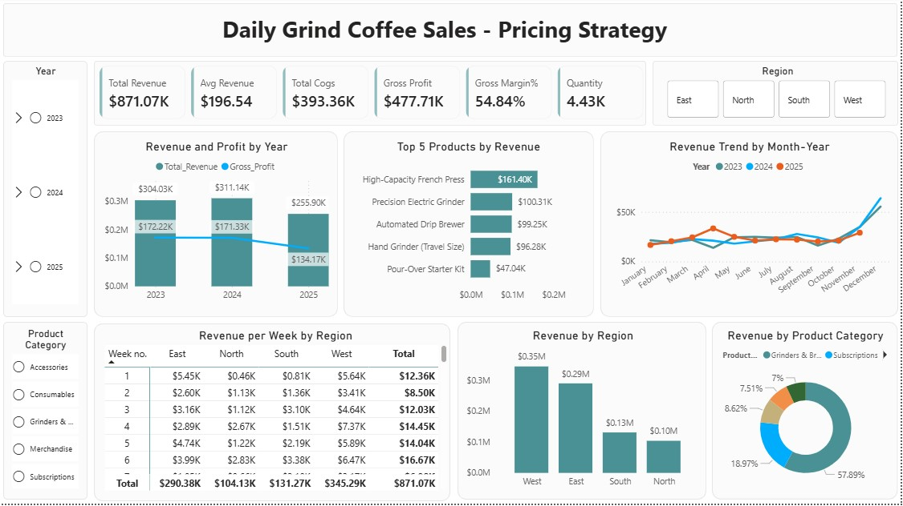

# Grind_Coffee_Sales_Pricing_Strategy-
🎯 Project Objective: To analyze the decline in gross profit margins across the product portfolio using 2023–2025 data, identify low-margin products and key cost drivers, and recommend data-driven pricing and portfolio strategies to improve overall profitability.

Task for Analysis:
- Identify all products with a Gross Margin % (GMP) below 30% in Q3 2025.
- Create a dashboard showing Year-over-Year GMP, Revenue by Category, Product, and Region.
- Provide clear, data-backed recommendations on which items require a price increase or discontinuation.

Overview Report :

[See Full Dashboard Here!](https://app.powerbi.com/view?r=eyJrIjoiNzNjZDU5MzctODM1OC00NDExLWJhMmMtNDYyZWQwODJkNTUwIiwidCI6ImRmODY3OWNkLWE4MGUtNDVkOC05OWFjLWM4M2VkN2ZmOTVhMCJ9)

🔧 Project Process -->

- Dataset creation:
+ Multiple raw sales datasets were provided in separate Excel files, each containing different aspects of business data (orders, products, customers, etc.).
+ All Excel files were first imported into a SQL environment as individual tables for further processing.
Data cleaning steps were performed, including handling missing values, correcting data types, and removing duplicates.
Common keys (such as Product ID, Order ID, and Customer ID) were identified to establish relationships between tables.
SQL joins (INNER JOIN, LEFT JOIN) were used to merge multiple tables and create a unified dataset.
Common Table Expressions (CTEs) were utilized to simplify complex transformations and improve query readability.
Filters and conditions were applied to ensure only relevant and accurate data was included.
The final transformed dataset was validated for consistency and accuracy.
This final dataset was then used for dashboard creation and further analysis in Power BI.
